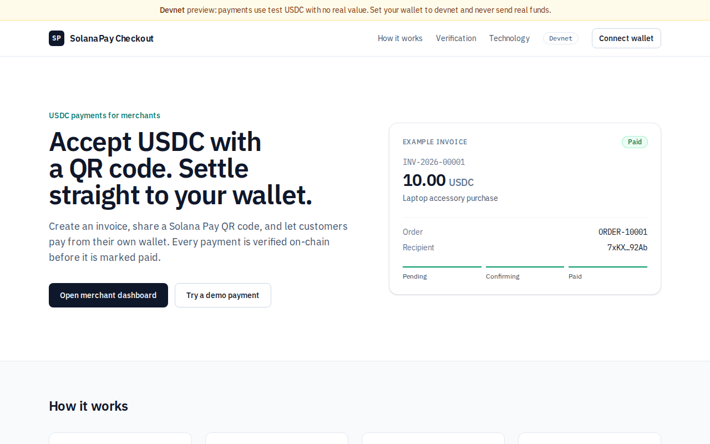
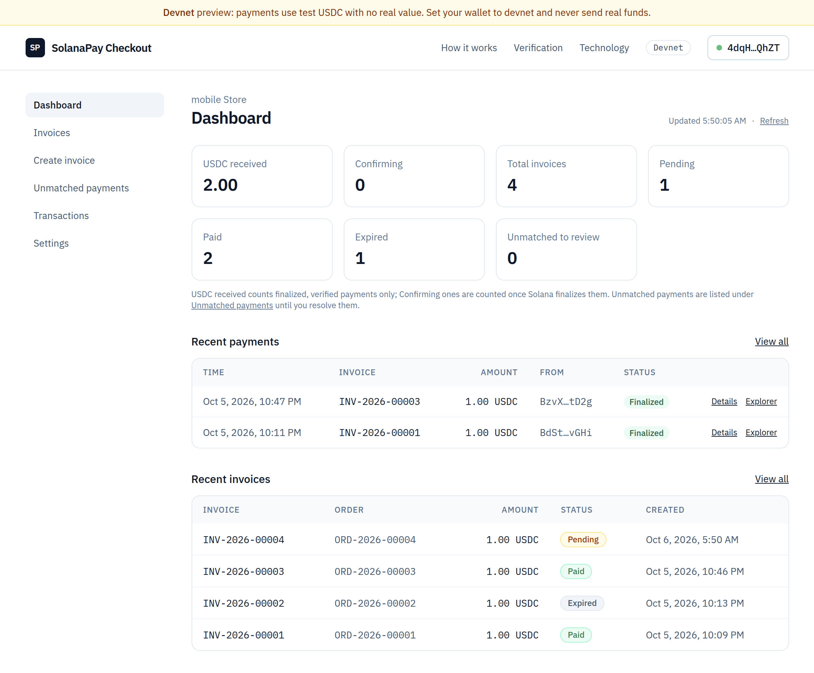
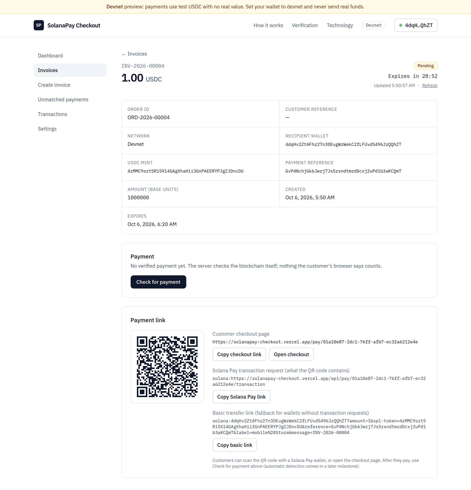
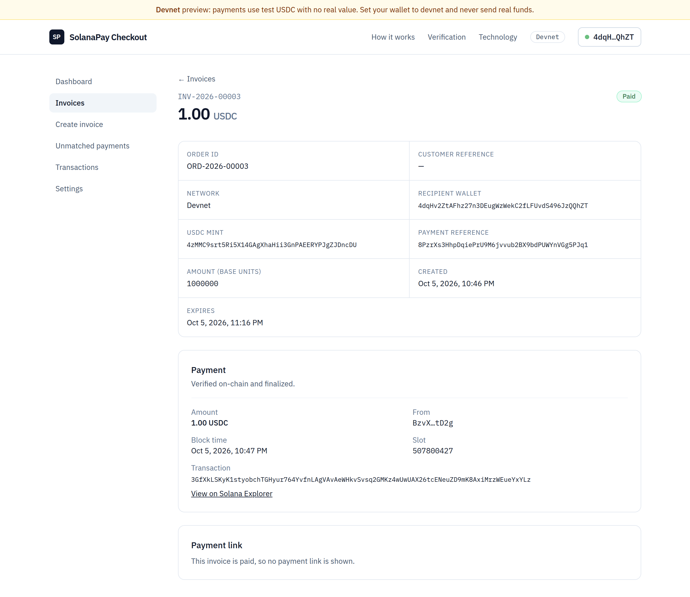

# SolanaPay Checkout

> USDC checkout for merchants, powered by Solana Pay.

**Status:** early development. Phases 1–13 complete (environment, app skeleton, database, wallet sign-in, invoices, Solana Pay QR, transaction requests, in-browser payment, on-chain payment verification, automatic detection and expiry, merchant dashboard and settings, transaction history, security hardening, automated tests, devnet deployment).

**Live (devnet):** https://solanapay-checkout.vercel.app
Devnet only. Do not send real funds.

## Overview
Merchants create invoices and share a Solana Pay QR code or link; customers pay
in USDC from their own wallet; the backend independently verifies the payment on-chain.

## Features
Implemented so far:
- Landing page (responsive, network-aware devnet banner)
- Validated configuration: the server refuses to start on missing/invalid
  environment variables, and USDC mints must match Circle's official addresses
- Structured JSON logging with secret redaction
- `GET /api/health`: reports app and database status (503 when the database is down)
- Sign-In With Solana backend: one-time challenges, Ed25519 signature verification,
  database-backed sessions, CSRF protection, rate limiting (see [docs/security.md](docs/security.md))
- Wallet connection via Wallet Standard (Phantom, Solflare, …): connect/disconnect,
  shortened address, devnet SOL and USDC balances (Circle's mint only), sign-in/out,
  wallet-rejection and network-mismatch handling
- Merchant onboarding (business name, email, validated payout wallet)
- Invoices: create (USDC amount, optional order ID or automatic `ORD-YYYY-NNNNN`,
  description, expiry), list with status filters and pagination, detail page;
  per-merchant numbering `INV-YYYY-NNNNN`; idempotent creation; payment terms fixed
  by the server and immutable after creation (see [docs/payment-flow.md](docs/payment-flow.md))
- Merchant dashboard: USDC received (finalized only), Confirming (count and amount in
  flight), total / pending / paid / expired invoices, unmatched to review, recent
  payments with Explorer links, recent invoices; updates itself every 30 s while visible
- Settings: business name and email; payout wallet change confirmed by a fresh
  signature from the signed-in wallet (new invoices only, audited); network and
  currency shown read-only
- Transaction history: every verified payment, newest first, with All / Confirming /
  Finalized / Late filters, exact search by signature or invoice number, a detail page
  with every stored field, and a CSV export of the current view (spreadsheet-safe)
- Security hardening: the app runs as a least-privilege database role that can't
  disable the audit and payment-evidence rules; security headers with a baseline CSP on
  every route; payout wallets checked on-chain (fails closed) and never shared between
  merchants; other sessions signed out on a payout change; expired sign-in data cleaned
  up automatically
- Solana Pay QR code for each invoice (spec-tested), and a public checkout page
  (`/pay/[id]`) with QR, "Open in wallet" and expired state
- Solana Pay Transaction Requests (`/api/pay/[id]/transaction`): over HTTPS the QR asks
  our server for an unsigned USDC transaction built from the stored invoice, so the
  payment reference is always included; the plain transfer link remains as a fallback
  (see [docs/payment-flow.md](docs/payment-flow.md))
- On-chain payment verification: the server finds the payment by its Solana Pay
  reference and checks recipient, mint, exact amount, reference, network (genesis hash)
  and finality against the stored invoice; Confirming → Paid; late payments flagged
- Unmatched payments (suspense list): real USDC that can't settle an invoice (no or
  unknown reference, wrong amount, paid twice, closed invoice) is recorded for review,
  never auto-paid; merchants look up transactions by signature and resolve entries
- Payment details on the invoice page, "Payment confirmed" on the customer page, USDC
  received on the dashboard
- Automatic detection: the checkout page polls a public status API and updates itself
  (Pending → Confirming → "Payment confirmed"); a background reconciler finds payments
  for customers who left the page
- Automatic expiry, chain first: overdue invoices become Expired only after a successful
  on-chain check finds no payment; money arriving later is recorded for review
- Database-backed rate limits with `Retry-After`, and one shared RPC budget
- In-browser payment: on a computer with a wallet extension, "Pay with a browser
  wallet" asks the server for the payment transaction (stored terms, reference
  included) and the wallet signs and sends it; rejections, wallet errors and server
  refusals are told apart, and a browser-wide note prevents paying twice from two tabs
- PostgreSQL schema for merchants, invoices, payments and an append-only audit log,
  with database-level constraints (see [docs/database.md](docs/database.md))

Planned features are listed in the [Roadmap](#roadmap) and only move here once
implemented and tested.

## Architecture
See [docs/architecture.md](docs/architecture.md).

## Technology Stack
Next.js 16 · TypeScript · PostgreSQL 17 · Prisma 7 · @solana/kit · Wallet Standard · Solana Pay

## Local Development

Prerequisites: Node.js 24 LTS (`nvm use`), Docker with Compose plugin.

    nvm use                           # Node 24 (from .nvmrc)
    npm ci                            # install exact versions from package-lock.json
    cp -n .env.example .env           # -n: never overwrite an existing .env
                                      # then set AUTH_SECRET and CRON_SECRET
    docker compose up -d              # start PostgreSQL
    npm run db:deploy                 # apply database migrations
    ./scripts/verify-env.sh           # check the environment
    npm run dev                       # http://localhost:3000

| Script | Purpose |
|---|---|
| `npm run dev` | Development server (logs pretty-printed via pino-pretty) |
| `npm run build` | Production build (includes type checking) |
| `npm run start` | Serve the production build |
| `npm run typecheck` | TypeScript strict check only |
| `npm test` | Unit and integration tests (Vitest) |
| `npm run db:test:setup` | Create and migrate the test database |
| `npm run db:role` | Create/update the least-privilege app database role (dev and test) |
| `npm run db:seed -- --wallet <addr>` | Development-only demo merchant and invoices (idempotent) |
| `npm run smoke` | Smoke-test the production build (starts and stops its own server) |
| `npm run test:e2e` | Browser tests (Playwright, Chromium) against a production build, with a test wallet and a mock Solana RPC |
| `npm run test:devnet` | Live devnet: real payments fetched by signature and verified (read-only, needs network) |
| `npm run reconciler` | Development: run payment detection and expiry every 30 s (dev server must be running) |

Health check: `curl http://localhost:3000/api/health`

## Environment Variables
See [.env.example](.env.example). `NEXT_PUBLIC_*` values are visible in the
browser and are **inlined at build time** (changing them requires a rebuild);
all others are server-only and read at startup. All values are validated with
Zod in `src/lib/config/`.

## Database Setup
Schema and migrations are managed with Prisma 7. See [docs/database.md](docs/database.md).

    npm run db:deploy     # apply migrations
    npm run db:status     # check migration state
    npm run db:role       # least-privilege role the app connects as (see docs/database.md)
    npm run db:check      # run the 57 database checks (rolled back)

## Devnet Setup
See [docs/devnet-testing.md](docs/devnet-testing.md): wallet setup, devnet SOL/USDC faucets,
and the manual test checklist.

## Testing
Tests use a separate database (name must end in `_test`): the code under test connects
as the app role (`TEST_DATABASE_URL`), and only the table reset uses the owner
(`TEST_MIGRATE_DATABASE_URL`).

    npm run db:test:setup   # once, and after new migrations
    npm test                # 587 unit and integration tests
    npm run db:check        # 57 database checks
    npx playwright install chromium   # once
    npm run test:e2e        # 14 browser tests: sign-in, onboarding, invoices, checkout, payment to PAID, dashboard
    npm run test:devnet     # 25 live checks of real devnet payments

How each suite works, and where every case of the specification is tested (valid
payment, wrong amount, wrong token, wrong recipient, expired invoice, duplicate
transaction, already-paid invoice, invalid reference): [docs/testing.md](docs/testing.md).
A GitHub Actions workflow (`.github/workflows/ci.yml`) runs all of it except the live
devnet suite on every push and pull request.

## Deployment
Deployed on Vercel (Hobby, `iad1`) with Neon Postgres (the app connects as a
least-privilege role through Neon's pooler), Helius as the server's devnet RPC, and
cron-job.org running payment detection and expiry every 2 minutes. Setup, secrets and
limits: [docs/deployment.md](docs/deployment.md).

    SMOKE_URL=https://solanapay-checkout.vercel.app npm run smoke   # checks the live site

## Security
Never share seed phrases or private keys. The application never requests,
stores, or uses private keys. See [docs/security.md](docs/security.md).

## Roadmap
Built so far: Phases 1–16 (this README). Next, toward real merchants: merchant API keys,
webhooks and e-commerce plugins; mainnet readiness (paid infrastructure, monitoring and
error tracking, managed secrets, a security review); refunds, more stablecoins and a
point-of-sale mode. See [docs/pitch.md](docs/pitch.md#roadmap).

## Screenshots
Landing page, with the public demo:

Merchant dashboard: verified USDC received, invoice counts, recent payments with Explorer links:

An invoice: payment terms fixed by the server, the Solana Pay QR (a Transaction Request), the checkout link:

The same kind of invoice once paid from a phone wallet, verified on-chain and finalized:

## Demo
**Try it:** open https://solanapay-checkout.vercel.app and click **Try a demo payment**
(0.01 test USDC). You need a Solana wallet set to devnet (e.g. Phantom) with a little
devnet SOL ([faucet.solana.com](https://faucet.solana.com)) and test USDC
([faucet.circle.com](https://faucet.circle.com), Solana devnet). The checkout turns
**Payment confirmed** once the server has verified your transaction on-chain.

Pitch, architecture, Solana integration and security model:
[docs/pitch.md](docs/pitch.md). Video scripts: [docs/demo-script.md](docs/demo-script.md).

## Solana Transaction
A devnet USDC payment made through a Solana Pay transaction request and verified by the
backend (INV-2026-00017, 1 USDC, finalized):
[`39m866og…`](https://explorer.solana.com/tx/39m866ogKRdHeuqrePGz7TwXrr3u1bcUsc5eaH2QrxtEUnPyDHR9pycmCCEfj1zd65HqzE2sRKCpJnga8emL9YE3?cluster=devnet)

## License
[MIT](LICENSE) © 2026 Ram Mahato
