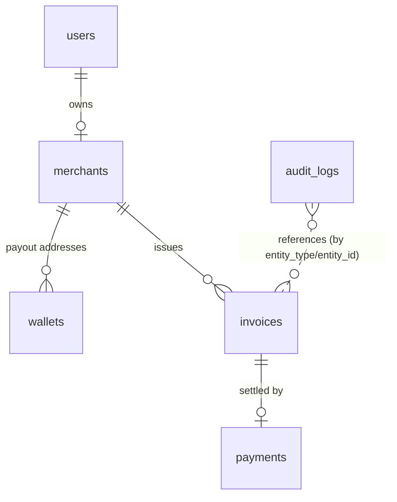

# Database

PostgreSQL 17, managed through Prisma ORM 7.10 (schema: `prisma/schema.prisma`,
migrations: `prisma/migrations/`).

## Entity relationships

| Table | Purpose | Key constraints |
|---|---|---|
| `users` | Signs in with a wallet (Phase 4) | `wallet_address` UNIQUE |
| `merchants` | Business profile, one per user (MVP) | `owner_user_id` UNIQUE, FK RESTRICT |
| `wallets` | Merchant payout addresses (public keys only) | UNIQUE `(merchant_id, address)`; at most one `is_default` per merchant |
| `invoices` | Payment requests | `reference` UNIQUE; UNIQUE `(merchant_id, invoice_number)`; `amount > 0`; `paid_at` set iff `PAID` |
| `payments` | Verified on-chain settlements | `signature` UNIQUE (replay protection); `invoice_id` UNIQUE; `amount > 0`; `finalized_at` set iff `FINALIZED` |
| `audit_logs` | Security/money events | Append-only (UPDATE/DELETE blocked by trigger) |

## Design decisions

- **Money as `BIGINT` base units.** USDC has 6 decimals: 10.00 USDC = `10000000`.
  Integers are exact; floating point is never used for money. In TypeScript these
  are `bigint` values. (`JSON.stringify` can't serialize `bigint`; API responses
  will send amounts as strings.)
- **Payment terms are copied onto each invoice** (`network`, `token_mint`,
  `token_decimals`, `recipient_wallet`). Verification compares the chain against
  these stored values, never against client input, and settings changes cannot
  alter an open invoice.
- **`network` on invoices and payments.** A devnet invoice can never be matched to
  a transaction from another network.
- **UUIDv7 primary keys** (generated by Prisma): globally unique and time-ordered,
  which keeps B-tree index inserts efficient. Raw SQL inserts must supply an `id`.
- **`TIMESTAMPTZ(3)` everywhere.** Prisma's default would be `TIMESTAMP` without
  time zone.
- **`ON DELETE RESTRICT`** for merchants → invoices → payments: financial records
  cannot disappear through a parent delete. Wallets cascade with their merchant.
- **Database-level constraints** hold even if application code has a bug.

## Invoice state machine (stored in `invoices.status`)

    DRAFT ──▶ PENDING ──▶ CONFIRMING ──▶ PAID
                 │             │
                 ├──▶ EXPIRED  └──▶ FAILED
                 └──▶ FAILED

- `CONFIRMING`: a matching transfer was verified at `confirmed` commitment; a
  `payments` row exists with `commitment = CONFIRMED`.
- `PAID`: the transaction was re-verified at `finalized` commitment; the payment
  has `commitment = FINALIZED`, `finalized_at` set, and the invoice `paid_at` set.
- Transitions are enforced in application code (Phase 9); the database enforces
  the consistency rules above.

## Hand-written SQL

Prisma's schema language can't express CHECK constraints, partial indexes or
triggers, so they are appended to the migration SQL (`--create-only`, edit, then
apply). `prisma migrate dev --create-only` producing an empty migration confirms
there is no drift between schema and database.

## Commands

| Command | Use |
|---|---|
| `npm run db:migrate` | Development: create and apply a migration (`prisma migrate dev`) |
| `npm run db:deploy` | Production/CI: apply pending migrations only (`prisma migrate deploy`) |
| `npm run db:status` | Show applied/pending migrations |
| `npm run db:check` | Run `scripts/db-constraint-check.sql`: 14 negative tests, rolled back |
| `npx prisma studio` | Browse data in a local web UI |

To add a change: edit `prisma/schema.prisma` → `npx prisma migrate dev --name <change>`
(add `--create-only` first if hand-written SQL is needed).

## Connection

`src/lib/db/client.ts` (server-only) uses the `@prisma/adapter-pg` driver with
timeouts: connect 5 s, query 10 s (client side), statement 10 s (server side).
`GET /api/health` returns 503 when the database is unreachable; details are
logged server-side only.

## Seed data

None yet. Demo data is added in Phase 6, once invoices can be created through the app.
