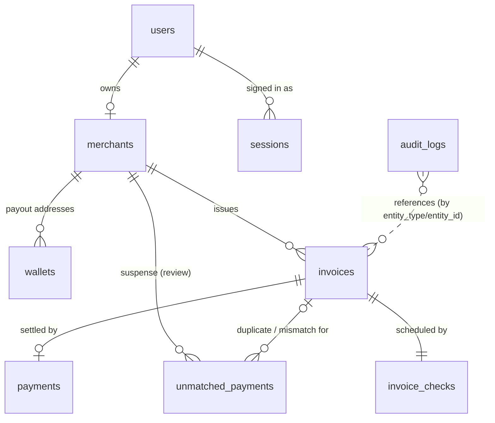

# Database

PostgreSQL 17, managed through Prisma ORM 7.10 (schema: `prisma/schema.prisma`,
migrations: `prisma/migrations/`).

## Entity relationships

| Table | Purpose | Key constraints |
|---|---|---|
| `users` | Signs in with a wallet (Phase 4) | `wallet_address` UNIQUE |
| `merchants` | Business profile, one per user (MVP) | `owner_user_id` UNIQUE, FK RESTRICT |
| `wallets` | Merchant payout addresses (public keys only) | UNIQUE `(merchant_id, address)`; at most one `is_default` per merchant |
| `invoices` | Payment requests | `reference` UNIQUE; UNIQUE `(merchant_id, invoice_number)`; `amount > 0`; `paid_at` set iff `PAID` |
| `payments` | Verified on-chain settlements | `signature` UNIQUE (replay protection); `invoice_id` UNIQUE; `amount > 0`; `finalized_at` set iff `FINALIZED`; evidence immutable, no DELETE (trigger; only CONFIRMED → FINALIZED may change) |
| `unmatched_payments` | Suspense: real incoming USDC that can't settle an invoice automatically (Phase 9) | `signature` UNIQUE; `amount > 0`; `reason` ↔ `invoice_id` / `reference` consistency; RESOLVED requires note + resolver + time, and is final; invoice must belong to the same merchant; evidence immutable, no DELETE (triggers) |
| `invoice_checks` | When the reconciler next looks at an invoice (Phase 10) | PK `invoice_id` (one per invoice, created by trigger); `attempts >= 0`; cascade with invoice |
| `audit_logs` | Security/money events | Append-only (UPDATE/DELETE blocked by trigger) |
| `auth_nonces` | One-time wallet challenges: sign-in (Phase 4) and payout-wallet change (Phase 11) | `nonce` UNIQUE; single use via `used_at`; 5-minute expiry; `purpose` (`SIGN_IN`/`PAYOUT_CHANGE`); `new_payout_wallet` set exactly for `PAYOUT_CHANGE` (CHECK) |
| `sessions` | Server-side sessions (Phase 4) | `token_hash` UNIQUE (HMAC of the cookie token); `revoked_at`; cascade with user |
| `rate_limits` | Fixed-window request counters (Phase 4) | PK `(key, window_start)` |
| `invoice_counters` | Per-merchant, per-year counters (Phase 6) | PK `(merchant_id, kind, year)`; `kind` = `INVOICE` (INV-YYYY-NNNNN) or `ORDER` (auto order IDs ORD-YYYY-NNNNN); `last_value > 0` |

## Design decisions

- **Money as `BIGINT` base units.** USDC has 6 decimals: 10.00 USDC = `10000000`.
  Integers are exact; floating point is never used for money. In TypeScript these
  are `bigint` values. (`JSON.stringify` can't serialize `bigint`; API responses
  will send amounts as strings.)
- **Payment terms are copied onto each invoice** (`network`, `token_mint`,
  `token_decimals`, `recipient_wallet`). Verification compares the chain against
  these stored values, never against client input, and settings changes cannot
  alter an open invoice.
- **`network` on invoices and payments.** A devnet invoice can never be matched to
  a transaction from another network.
- **UUIDv7 primary keys** (generated by Prisma): globally unique and time-ordered,
  which keeps B-tree index inserts efficient. Raw SQL inserts must supply an `id`.
- **`TIMESTAMPTZ(3)` everywhere.** Prisma's default would be `TIMESTAMP` without
  time zone.
- **`ON DELETE RESTRICT`** for merchants → invoices → payments: financial records
  cannot disappear through a parent delete. Wallets cascade with their merchant.
- **Database-level constraints** hold even if application code has a bug.
- **Invoice numbers** come from `invoice_counters`, incremented with
  `INSERT … ON CONFLICT DO UPDATE … RETURNING` inside the invoice transaction; the
  row lock serializes concurrent creates, so there are no duplicates or gaps
  (a rolled-back create rolls back its increment too).
- **Idempotency:** `invoices.idempotency_key` (UNIQUE per merchant) plus
  `request_hash` (SHA-256 of the normalized request); CHECK: both set or both null.
- **Immutable payment terms:** trigger `invoices_terms_immutable` rejects UPDATEs of
  amount, mint, decimals, recipient, reference, network, currency, merchant,
  invoice number, order ID, created_at and the idempotency fields. See
  [payment-flow.md](payment-flow.md).

## Payment ledger rules (Phase 9)

- **One transaction, one record:** a signature is stored in `payments` *or*
  `unmatched_payments`, never both. Each table's UNIQUE index handles duplicates within
  it; a trigger on both tables checks the other, under a per-signature advisory lock
  (`pg_advisory_xact_lock`) so two concurrent inserts can't both pass.
- **Unmatched reasons:** `NO_REFERENCE` (no reference at all), `UNKNOWN_REFERENCE`
  (reference not used by any of the merchant's invoices), and three that point at an
  invoice: `AMOUNT_MISMATCH`, `DUPLICATE_PAYMENT`, `INVOICE_NOT_PAYABLE`.
- **Evidence is immutable:** payments and unmatched entries can't be edited or deleted.
  Only the finality upgrade (CONFIRMED → FINALIZED) and resolving an unmatched entry
  (once, with a note) are allowed.

## Detection scheduling (Phase 10)

`invoice_checks`: one row per invoice, inserted by an `AFTER INSERT` trigger on
`invoices` in the same transaction (so no creation path can leave an invoice unwatched;
the migration backfilled existing invoices). Columns: `next_check_at` (null = no
further checks), `last_checked_at`, `attempts` (consecutive RPC failures, ≥ 0),
`last_error`, `lease_until` (null = not claimed; a reconciler run's claim). See
payment-flow.md §7 for the cadence.

## Wallet challenges (Phase 11)

`auth_nonces.purpose` says what a signed challenge authorizes. Sign-in consumes only
`SIGN_IN` challenges; the payout-wallet change consumes only `PAYOUT_CHANGE` challenges
issued to the signed-in wallet, and takes the new wallet from `new_payout_wallet`, never
from the request. Migration `20261004090000_challenge_purpose` (existing rows default to
`SIGN_IN`). Changing the payout wallet flips `wallets.is_default` in one transaction
(the partial unique index keeps exactly one default); existing invoices keep their
`recipient_wallet` (immutable terms).

## Invoice state machine (stored in `invoices.status`)

    DRAFT ──▶ PENDING ──▶ CONFIRMING ──▶ PAID
                 │             │
                 ├──▶ EXPIRED  └──▶ FAILED
                 └──▶ FAILED

- `CONFIRMING`: a matching transfer was verified at `confirmed` commitment; a
  `payments` row exists with `commitment = CONFIRMED`.
- `PAID`: the transaction was re-verified at `finalized` commitment; the payment
  has `commitment = FINALIZED`, `finalized_at` set, and the invoice `paid_at` set.
- Transitions are enforced in application code (Phase 9); the database enforces
  the consistency rules above.

## Hand-written SQL

Prisma's schema language can't express CHECK constraints, partial indexes or
triggers, so they are appended to the migration SQL (`--create-only`, edit, then
apply). `prisma migrate dev --create-only` producing an empty migration confirms
there is no drift between schema and database.

## Commands

| Command | Use |
|---|---|
| `npm run db:migrate` | Development: create and apply a migration (`prisma migrate dev`) |
| `npm run db:deploy` | Production/CI: apply pending migrations only (`prisma migrate deploy`) |
| `npm run db:status` | Show applied/pending migrations |
| `npm run db:check` | Run `scripts/db-constraint-check.sql`: 57 checks (48 data rules, 9 app-role denials), rolled back |
| `npm run db:test:setup` | Create/migrate the `*_test` database used by `npm test` (as the owner) |
| `npm run db:role` | Create or update the app role `solanapay_app` and its grants in the dev and test databases (idempotent) |
| `npx prisma studio` | Browse data in a local web UI |

To add a change: edit `prisma/schema.prisma` → `npx prisma migrate dev --name <change>`
(add `--create-only` first if hand-written SQL is needed).

## Roles (Phase 13.5)

| Role | Connection | Can |
|---|---|---|
| owner (Docker `POSTGRES_USER`, or the provider's admin role) | `MIGRATE_DATABASE_URL`, `TEST_MIGRATE_DATABASE_URL` | everything: migrations (`prisma.config.ts`), test resets (TRUNCATE) |
| `solanapay_app` | `DATABASE_URL`, `TEST_DATABASE_URL` | SELECT, INSERT, UPDATE on app tables; DELETE only on `auth_nonces`, `sessions`, `rate_limits`; INSERT-only on `audit_logs`; nothing on `_prisma_migrations`; no DDL |

Grants are in `scripts/db-app-role.sql`; it resets them on every run (anything granted
by hand is removed). Tables created by later migrations get SELECT, INSERT and UPDATE
automatically (default privileges for the owner); a table the app must DELETE from
needs a line in the script and a re-run of `npm run db:role`.

Setting up a new environment: create the owner URL, run migrations, then run the script
once as the owner with `APP_DB_PASSWORD` set (hosted:
`psql "$MIGRATE_DATABASE_URL" -f scripts/db-app-role.sql`) and point `DATABASE_URL` at
`solanapay_app`.

## Connection

`src/lib/db/client.ts` (server-only) uses the `@prisma/adapter-pg` driver with
timeouts: connect 5 s, query 10 s (client side), statement 10 s (server side).
`GET /api/health` returns 503 when the database is unreachable; details are
logged server-side only.

## Seed data (development only)

    npm run db:seed -- --wallet <your wallet address> [--name "Demo Shop"]

Creates a merchant for the wallet (or reuses the existing one, unchanged) and 4 demo
invoices through the real `createInvoice()` code path. Idempotent (fixed
idempotency keys `seed-demo-1…4`). Refuses unless `APP_ENV=development`, the
database host is local, and the database name doesn't end in `_test`. Never run
automatically.
