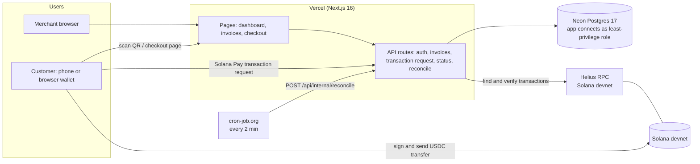
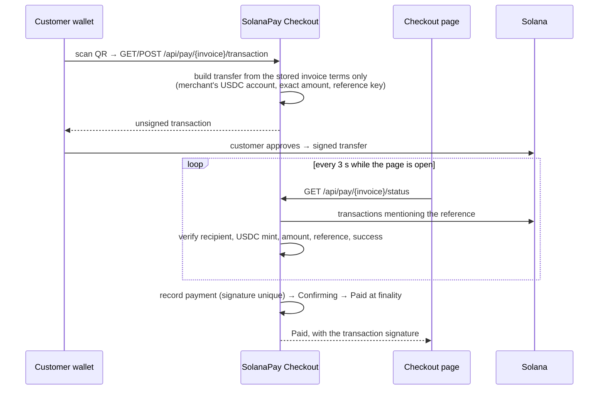

# SolanaPay Checkout — pitch

> **Accept USDC with a QR code: paid straight to your wallet, verified on-chain.**

Live on Solana devnet: **https://solanapay-checkout.vercel.app** (test USDC only; try
"Try a demo payment" with a devnet wallet). Code: https://github.com/Ram2k24/solanapay-checkout

## Problem

Small merchants who want to accept stablecoins have two poor options:

- **Share a wallet address** and check incoming transfers by hand. Nothing ties a
  transfer to an order, amounts get mistyped, and a screenshot of a "sent" screen is
  not proof of payment.
- **Use a custodial crypto payment processor**, which holds the merchant's funds, adds
  fees and onboarding, and becomes one more party to trust.

What's missing in between: a checkout that issues proper invoices and proves each
payment from the chain, while the money goes **directly to the merchant's own wallet**.

## Solution

SolanaPay Checkout is a merchant checkout built on Solana Pay:

1. The merchant signs in with their wallet (no password) and creates an invoice in USDC.
2. The customer scans a Solana Pay QR code with a phone wallet, or pays from a browser
   wallet on the checkout page.
3. The USDC goes from the customer's wallet **straight to the merchant's wallet**. The
   app never holds funds or keys.
4. The backend finds the transaction on Solana and checks it against the invoice:
   recipient, token, exact amount, the invoice's unique reference, success and finality.
   Only then is the invoice marked **Paid**.
5. The merchant sees invoices, payments and totals on a dashboard, with links to Solana
   Explorer and a CSV export.

## Target users

- Small online and in-person merchants (shops, freelancers, cafés, service providers)
  who want to accept USDC without a custodian.
- Merchants serving customers who already hold USDC on Solana.
- Builders who want a reference implementation of a correct Solana Pay checkout.

## What works today (devnet)

- Wallet sign-in (Sign-In With Solana), merchant profile, payout wallet with on-chain checks
- USDC invoices: exact amounts, order IDs, expiry, immutable payment terms
- Solana Pay QR codes: Transaction Requests over HTTPS (verified with Phantom on Android),
  transfer links as fallback
- In-browser payment with Wallet Standard wallets (tested with Phantom)
- On-chain verification; automatic detection; Confirming → Paid at finality; late
  payments settle and are flagged; duplicate and mismatched payments go to a review
  list instead of being lost
- Dashboard, transaction history with search and CSV export
- Public "Try a demo payment" (0.01 USDC) for anyone with a devnet wallet

Not built (yet): merchant API keys and webhooks, e-commerce plugins, refunds, mainnet.

## Architecture

There is **no custom smart contract**: payments are standard SPL Token transfers, and all
verification is done off-chain against public chain data. That keeps the attack surface
small and the funds flow identical to a normal wallet transfer.

## Payment flow

If the page is closed, the scheduled reconciler (every 2 minutes) finds the payment the
same way, and expires unpaid invoices.

## How it uses Solana

| Solana feature | How we use it |
|---|---|
| **Solana Pay** | Transfer request URLs and **Transaction Requests** (the wallet fetches a server-built transaction), per the Solana Pay spec |
| **Reference keys** | Every invoice has a unique public key added to the transfer; the server finds payments with `getSignaturesForAddress(reference)` |
| **SPL Token** | `TransferChecked` of Circle's USDC mint into the merchant's associated token account (created idempotently if missing) |
| **Commitment levels** | `confirmed` shows "Confirming"; `finalized` marks the invoice Paid |
| **Wallet Standard** | Wallet discovery, in-browser `signAndSendTransaction`, and `signMessage` for Sign-In With Solana |
| **Cluster check** | The server refuses to verify unless the RPC's genesis hash is devnet's (a mainnet RPC can't be used by mistake) |
| **Account checks** | A payout wallet must be on-curve and, on-chain, absent or a plain System account (no program, token or stake accounts) |

Built with `@solana/kit` 8.3, `@solana-program/token`, `@solana/kit-plugin-wallet`.

## Security model

- **Non-custodial:** no private keys or seed phrases are ever requested, stored or used;
  the server never signs customer transactions; funds never pass through the app.
- **The chain is the authority, not the browser:** payment terms come only from the stored
  invoice; an invoice becomes Paid only after the server verifies the transaction. A test
  proves that a wallet claiming "sent" without a real transaction changes nothing.
- **Exact verification:** recipient, mint, amount in integer base units, the invoice's
  reference, success, finality; one transaction can settle only one invoice.
- **Database rules the app can't switch off:** immutable invoice terms and payment
  evidence, append-only audit log, unique signatures; the app runs as a least-privilege
  role (no DDL, no TRUNCATE).
- **Web hardening:** Content-Security-Policy, HSTS, anti-framing, same-origin checks,
  rate limits, signed wallet challenges for sign-in and payout changes, sessions revoked
  on payout change.
- **Verified by tests:** 595 unit and integration tests, 57 database checks, 15 browser
  tests, a live devnet suite re-verifying real payments, all in CI; key rules
  mutation-checked.

Details: [security.md](security.md).

## Demo flow (3 minutes)

1. Landing page → **Try a demo payment** → checkout for 0.01 USDC.
2. Pay with Phantom (browser) → page turns **Payment confirmed** within seconds.
3. Open the transaction on Solana Explorer: same amount, recipient and reference.
4. Merchant side: sign in → create an invoice → scan its QR with a phone wallet → Paid.
5. Dashboard: totals, recent payments; Transactions: search, details, CSV.

Full scripts for both videos: [demo-script.md](demo-script.md).

## Validation

<!-- H5: fill in, or keep the honest line below. -->
_No external merchant feedback yet._

## Roadmap

Next steps toward real merchants (details in the Phase 17 production roadmap):

- **Integrations:** merchant API keys, webhooks, e-commerce plugins (the "easy to
  integrate" part), payment links without an account.
- **Mainnet readiness:** paid infrastructure tiers, monitoring and error tracking,
  managed secrets, a security review, legal and compliance work per market.
- **Product:** refunds, more stablecoins, point-of-sale mode, notifications.

## Team

<!-- H5: name, role, relevant experience. -->
_To be completed._
